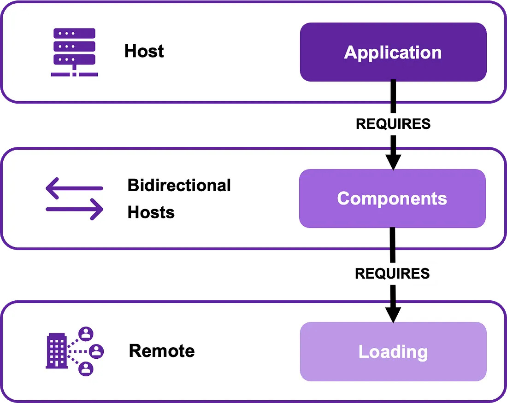

https://luiscameroon.medium.com/micro-frontends-with-module-federation-d5d9e135b0f1

Introduction
As web applications grow in complexity, maintaining a monolithic codebase becomes challenging. Micro-frontends offer a solution by breaking down an application into smaller, self-contained modules. Integrating Micro-frontends with Module Federation allows developers to build scalable, modular, and efficient web applications. In this article, we will explore the concept of Micro-frontends with Module Federation and demonstrate its implementation using React and Vite.

What are Micro-frontends?
Micro-frontends are an architectural approach that breaks down a complex web application into smaller, independently deployable and scalable modules. Each module represents a self-contained feature or functionality, developed by different teams or using different technologies. This approach enables teams to work autonomously, promotes code reusability, and simplifies maintenance.

Introducing Module Federation
Module Federation is a powerful feature provided by Webpack, Vite/Rollup, and Snowpack, allowing the dynamic loading and sharing of JavaScript modules between applications. By combining Micro-frontends with Module Federation, we can create a distributed architecture where modules can be loaded on-demand, sharing resources and dependencies as required.

Module Federation introduces several terminologies that are essential to understand how modules interact and communicate with each other. Let’s delve into the key terminologies: Host, Bidirectional Hosts and Remote.

        Host: In Module Federation, the Host is the application that consumes and integrates remote modules exposed by other applications. It acts as the main container for the entire application and is responsible for orchestrating the integration of remote modules. The Host application can dynamically load and render remote modules, allowing seamless integration and composition of functionality from multiple sources.

        Bidirectional Hosts: Bidirectional Hosts refer to Host applications that can both consume and expose modules. In these scenarios, the Host application functions as both the consumer and provider of modules. This means that the Host application can consume remote modules from other applications while also exposing its own modules for consumption by other Host or Remote applications. Bidirectional Hosts enable a more cohesive and collaborative approach, allowing modules to be shared across different applications in a bidirectional manner.

        Remote: A Remote module is a standalone application or module that exposes certain components, functions, or assets for consumption by other applications. It is developed and deployed independently from the Host application. Remote modules can be hosted on different domains or served from separate servers. The Host application can consume and render the exposed components or utilize the functionality provided by the Remote module.

Benefits of Micro-frontends with Module Federation

Implementation with React and Vite
To demonstrate the implementation of Micro-frontends with Module Federation, we will use React, a popular JavaScript library for building user interfaces, and Vite, a fast development server and build tool.